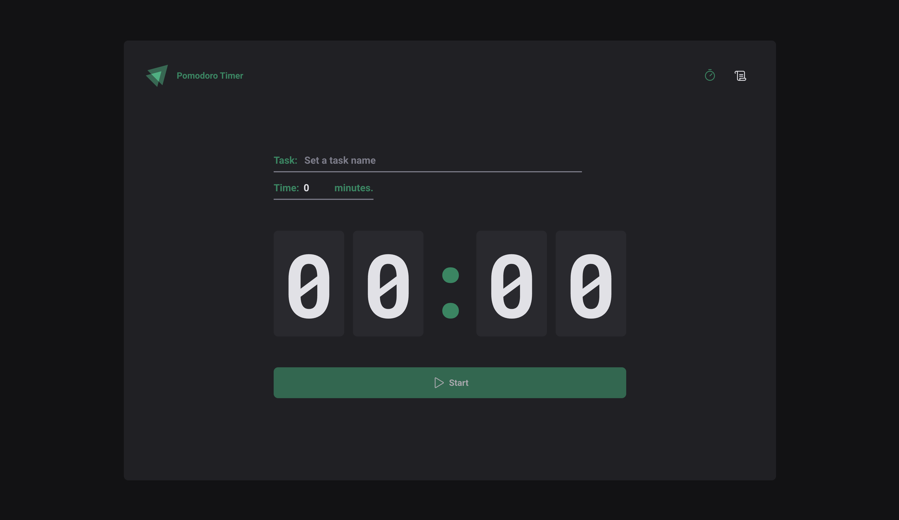

## About the project


## Pomodoro Timer Application

This Pomodoro Timer application is built using Vite, TypeScript, and Styled Components to provide a sleek, efficient, and modern productivity tool. The Pomodoro technique is a time management method that breaks work into intervals, traditionally 25 minutes in length, separated by short breaks. This application allows users to focus on tasks with timed work sessions and breaks, enhancing productivity and focus.


To reproduce locally:
```bash
  cd pomodoro-timer-with-TypeScript
  npm i
  npm run dev
```

## Tools used
- Vite
- Typescript
- Styled Components
- Context
- Reducers
- Local Storage
- Providers
- React Hook Form
- Zod
- Clean Code

## Built with


